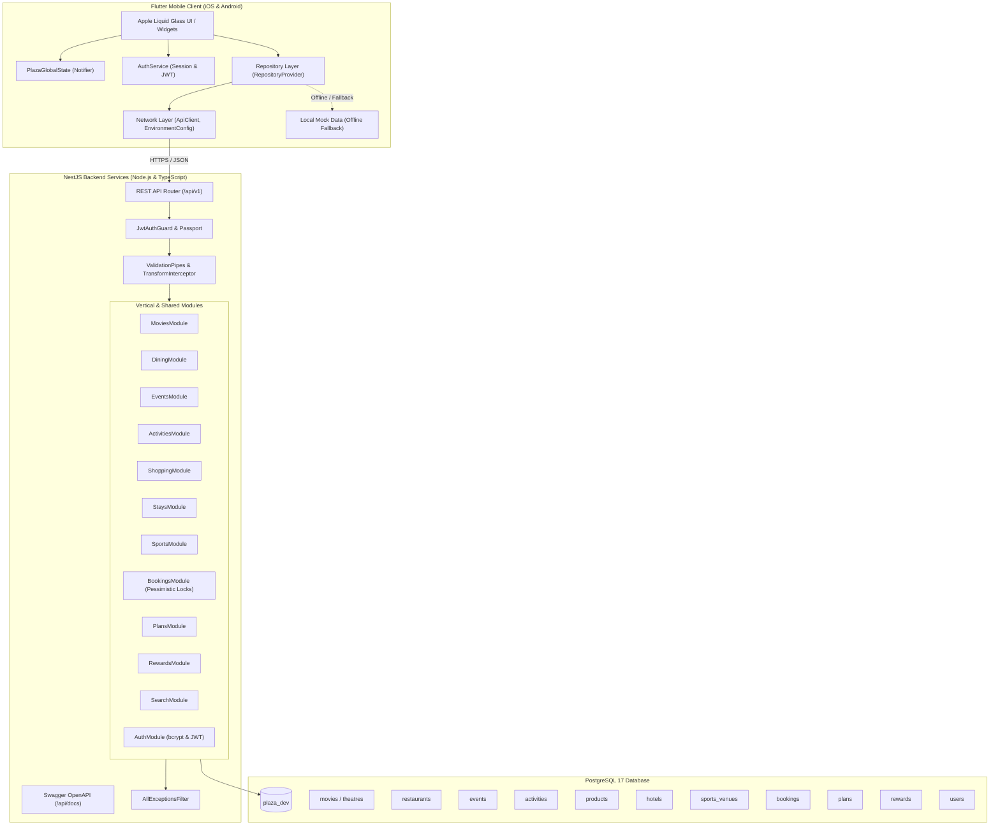

# PLAZA System Architecture

PLAZA is a production-grade consumer super-application engineered for India-wide discovery and bookings across seven verticals:
1. **Movies** (Cinemas, Seat Selection, Showtimes, IMAX/4DX)
2. **Dining** (Fine Dining, Reservations, Menus, Curated spots)
3. **Events** (Concerts, Comedy, Festivals, VIP Tiers)
4. **Activities** (Go-Karting, Bowling, Gaming, Turf)
5. **Shopping** (Flagship Brands, Deals of the Day, In-store collection)
6. **Stays** (Heritage Palaces, Luxury Resorts, Weekend Villas)
7. **Sports** (Turf Booking, Courts, Equipment add-ons)

Unified Super-App Features:
- **Unified Bookings Wallet**: Live ticket passes with QR codes, active reservation counters, and cancellation lifecycles across all 7 verticals.
- **Plans / Build My Day**: Multi-vertical itinerary wizard connecting movies, dining, and activities into an optimized single day.
- **Profile & Rewards**: Loyalty tiers (Plaza Black, Gold, Silver), redeemable vouchers, and activity history.
- **Global Search**: High-performance cross-vertical search index with debounced client queries.

---

## 1. High-Level System Architecture

---

## 2. Phase 7 Integration Matrix

| Vertical / Feature | Flutter Repository | REST API Endpoint | PostgreSQL 17 Entity | Concurrency & Validation | Status |
|---|---|---|---|---|---|
| **Movies** | `MovieRepository` (`Local`/`Api`) | `/movies`, `/movies/:id`, `/bookings/movie` | `MovieEntity`, `TheatreEntity`, `BookingEntity` | Seat conflict detection | ✅ End-to-End Verified |
| **Dining** | `DiningRepository` (`Local`/`Api`) | `/dining`, `/dining/:id`, `/bookings/dining` | `RestaurantEntity`, `BookingEntity` | Party size & slot reservation | ✅ End-to-End Verified |
| **Events** | `EventRepository` (`Local`/`Api`) | `/events`, `/events/:id`, `/bookings/event` | `EventEntity`, `BookingEntity` | Tier remaining bounds check | ✅ End-to-End Verified |
| **Activities** | `ActivityRepository` (`Local`/`Api`) | `/activities`, `/activities/:id`, `/bookings/activity` | `ActivityEntity`, `BookingEntity` | Package & add-on verification | ✅ End-to-End Verified |
| **Shopping** | `ShoppingRepository` (`Local`/`Api`) | `/shopping`, `/shopping/:id`, `/bookings/shopping` | `ProductEntity`, `BookingEntity` | Server-side price check + GST | ✅ End-to-End Verified |
| **Stays** | `StayRepository` (`Local`/`Api`) | `/stays`, `/stays/:id`, `/bookings/stays` | `HotelEntity`, `BookingEntity` | Server room rate calculation | ✅ End-to-End Verified |
| **Sports** | `SportsRepository` (`Local`/`Api`) | `/sports`, `/sports/:id`, `/bookings/sports` | `SportsVenueEntity`, `BookingEntity` | Pessimistic Lock (`pessimistic_write`) | ✅ End-to-End Verified |
| **Bookings Wallet** | `BookingRepository` (`Local`/`Api`) | `/bookings`, `/bookings/:id` | `BookingEntity` | Authenticated user aggregation | ✅ End-to-End Verified |
| **Global Search** | `SearchRepository` (`Local`/`Api`) | `/search?q=` | All 7 entity tables | Debounced 300ms cross-query | ✅ End-to-End Verified |
| **Authentication** | `AuthService` | `/auth/register`, `/auth/login`, `/auth/me` | `User` | bcrypt hashing + JWT tokens | ✅ End-to-End Verified |
| **Payment Gateway** | `PaymentService` & `RazorpayAdapter` | Internal pipeline + `/webhooks/razorpay` | `BookingEntity`, `WebhookEventEntity` | HMAC-SHA256 signature + Idempotency | ✅ End-to-End Verified |
| **Messaging & SMS** | `TwilioSmsAdapter` | Automated transactional dispatch | `NotificationEntity` | SMS confirmation on `order.paid` | ✅ End-to-End Verified |

---

## 3. Key Design Patterns & Guarantees

### A. Swappable Repository Pattern & Mutation Safety Policy
Every vertical in `lib/core/repositories` exposes an abstract contract with both a `Local*Repository` and an `Api*Repository`.
- **Read / Catalog Discovery**: Automatically falls back to high-fidelity cached local data if the server is offline or unreachable, guaranteeing uninterrupted discovery browsing.
- **Write / Mutations**: Mutations (`createOrder`, `bookSlot`, `createReservation`, `createBooking`, `bookTickets`, `cancelBooking`) strictly fail on API failure rather than silently executing against mock state, guaranteeing financial and reservation integrity.

### B. Pessimistic Concurrency & High-Contention Locking
For high-contention sports venues and movie seats, the backend uses pessimistic database locking (`pessimistic_write`) inside an ACID database transaction. Any concurrent double-booking triggers HTTP 409 Conflict.

### C. Server-Side Price Authority (Price Tampering Defense)
Order subtotals, stay durations, ticket tiers, platform fees, and taxes are strictly calculated and validated on the backend from database entities. Any client-provided `totalPrice` is completely overridden.

### D. Multi-Tenant Authorization & Data Isolation
All user-specific resources (Bookings, Plans, Notifications) enforce `JwtAuthGuard`. The service layer validates `item.userId === req.user.sub`. Any cross-tenant access or modification returns HTTP 403 Forbidden.

### E. Booking State Machine & Payment Lifecycle
Booking statuses follow a strict finite-state machine:
- `PENDING` ➔ `UPCOMING` / `CONFIRMED` ➔ `ACTIVE` ➔ `COMPLETED`
- `UPCOMING` / `ACTIVE` ➔ `CANCELLED` (triggers automated refund via `PaymentService`)
- Invalid transitions (e.g. `CANCELLED` ➔ `CONFIRMED`, `COMPLETED` ➔ `CANCELLED`) throw HTTP 400 Bad Request.

### F. Payment Provider Adapters & Webhook Security
- **Dynamic Provider Selection**: `PaymentService` routes requests to `RazorpayAdapter` or `SimulatedPaymentAdapter` based on configuration.
- **HMAC-SHA256 Cryptographic Verification**: Inbound webhook requests (`POST /webhooks/razorpay`) must contain a valid `x-razorpay-signature` generated with the shared webhook secret.
- **Database Idempotency Ledger**: `WebhookEventEntity` stores processed event IDs, guaranteeing zero duplicate transactions or double-booking transitions from webhook replays.

### G. Cloud Staging Infrastructure
- **Containerization**: Multi-stage `backend/Dockerfile` based on Node 20 Alpine.
- **Orchestration**: `docker-compose.staging.yml` managing NestJS API, PostgreSQL 17, and Redis with integrated health checks.
- **CI/CD Pipeline**: GitHub Actions (`staging-deploy.yml`) testing both Flutter and NestJS, validating migrations, and building staging images.

### I. Client Booking Idempotency
- **Client Idempotency Key**: `@Headers('idempotency-key')` accepted across all 7 booking routes.
- **Cache Persistence**: `IdempotencyRecordEntity` stores composite key `${userId}:${idempotencyKey}` in PostgreSQL 17.
- **Network Replay Defense**: Replayed client requests receive cached response instantly, avoiding duplicate bookings or double payment deductions.

### J. Zero-Regression Test Suite
- Flutter analyzer: 0 issues (`flutter analyze` clean).
- Flutter test suite: 58/58 tests passing across all features and navigation flows.
- Jest backend test suite: 36/36 tests passing across 4 suites (Phase 7 integration, Phase 8 reliability, Phase 9 payments/webhooks, Phase 10 cloud staging & idempotency).

