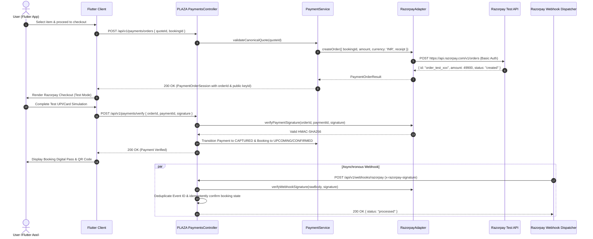

# PLAZA — Phase 12: Razorpay Test Mode Integration

## 1. Executive Summary

This document details the real **Razorpay TEST MODE** integration into the existing PLAZA payment architecture. PLAZA leverages its existing payment-provider abstraction, `RazorpayAdapter`, `PaymentService`, booking state machine, webhook processing, idempotency controls, and cryptographic verification without introducing duplicate payment architectures, parallel routes, or frontend secret exposure.

---

## 2. Existing Payment Architecture Reused

The integration directly reuses and preserves the following core components:

* **Abstraction & Providers:**
  * `IPaymentProvider` (`backend/src/modules/payments/interfaces/payment-provider.interface.ts`)
  * `RazorpayAdapter` (`backend/src/modules/payments/providers/razorpay.adapter.ts`)
  * `SimulatedPaymentAdapter` (`backend/src/modules/payments/providers/simulated-payment.adapter.ts`)
* **Core Business Logic & Pricing:**
  * `PaymentService` (`backend/src/modules/payments/payment.service.ts`) with canonical server-authoritative quote verification (`validateCanonicalQuote`).
  * `PaymentConfigService` (`backend/src/modules/payments/payment-config.service.ts`) with fail-closed configuration validation and safe summary projection.
* **API Endpoints Reused (Zero Duplicate Endpoints Added):**
  * `POST /api/v1/payments/orders` — Authenticated order creation with server-authoritative pricing and idempotency caching.
  * `POST /api/v1/payments/verify` — Server-side cryptographic HMAC-SHA256 signature verification.
  * `POST /api/v1/webhooks/razorpay` — Webhook handler with raw-body signature validation and replay deduplication.
* **Entities & Database:**
  * `PaymentEntity` (`backend/src/database/entities/payment.entity.ts`)
  * `BookingEntity` (`backend/src/database/entities/booking.entity.ts`)
  * `WebhookEventEntity` (`backend/src/database/entities/webhook-event.entity.ts`)
  * `IdempotencyRecordEntity` (`backend/src/database/entities/idempotency-record.entity.ts`)
  * `PaymentReconciliationEntity` & `PaymentRecoveryEntity`
* **Flutter Architecture:**
  * `BookingRepository` & `ApiBookingRepository` (`lib/core/repositories/`)
  * `PaymentOrderSession` (`lib/core/models/booking_quote.dart`)
  * `PlazaPaymentSheet` (`lib/core/widgets/plaza_payment_sheet.dart`)
  * `RazorpayCheckoutService` (`lib/core/services/razorpay_checkout_service.dart`)

---

## 3. Files Created / Modified

| File | Change Description |
| :--- | :--- |
| `backend/src/modules/payments/providers/razorpay.adapter.ts` | Enhanced `createOrder` and `refund` with native Razorpay REST API dispatch, strict integer paise validation (>= 100 paise), INR currency assertion, and HTTP Basic authentication. |
| `backend/src/modules/payments/payment-config.service.ts` | Added support for `PAYMENT_PROVIDER=razorpay` alongside `PAYMENT_MODE=RAZORPAY`. |
| `backend/src/phase12-razorpay-test-mode.spec.ts` | Created comprehensive 12-scenario backend test suite for Razorpay Test Mode. |
| `lib/core/services/razorpay_checkout_service.dart` | Created Flutter Razorpay Checkout coordinator adhering to strict zero-secret handling. |
| `test/phase12_razorpay_test_mode_test.dart` | Created dedicated 6-scenario Flutter test suite for Razorpay Test Mode client flow. |
| `PHASE_12_RAZORPAY_TEST_MODE.md` | Comprehensive architectural documentation and operational guide. |

---

## 4. Environment Variables & Configuration

### Backend Environment Variables (Render / Staging)

```bash
# Razorpay Test Mode Credentials (Backend Only)
RAZORPAY_KEY_ID=rzp_test_YourTestKeyIdHere
RAZORPAY_KEY_SECRET=YourTestSecretKeyHere
RAZORPAY_WEBHOOK_SECRET=YourWebhookSecretKeyHere

# Provider Selection
PAYMENT_MODE=RAZORPAY
RAZORPAY_LIVE_ENABLED=true
# (or PAYMENT_PROVIDER=razorpay)
```

> [!IMPORTANT]
> **Zero Secret Exposure Policy**: `RAZORPAY_KEY_SECRET` and `RAZORPAY_WEBHOOK_SECRET` must **NEVER** be placed in Flutter code, `--dart-define`, frontend assets, Git commits, or API responses. Only the public `RAZORPAY_KEY_ID` is provided to Flutter via the server-issued `PaymentOrderSession`.

---

## 5. End-to-End Test Mode Lifecycle Flow



---

## 6. Security, Cryptography & Idempotency

1. **Server-Authoritative Pricing:**
   - Any client-submitted `amount`, `price`, `total`, or `currency` is strictly verified against the immutable snapshot in `CanonicalQuoteRecord`. Tampered values immediately reject with `400 Bad Request` (`PAYMENT_AMOUNT_MISMATCH`).
2. **Payment Signature Verification:**
   - Evaluated as `HMAC-SHA256(order_id + "|" + payment_id, RAZORPAY_KEY_SECRET)`.
   - Compares expected vs received digest using constant-time `crypto.timingSafeEqual`.
3. **Webhook Verification & Replay Protection:**
   - Validates `x-razorpay-signature` against raw unparsed request body (`req.rawBody`).
   - Persists event records in `WebhookEventEntity`. Replayed event IDs return `{ status: "ignored", reason: "already_processed" }` with zero duplicate side effects.
4. **Order Creation Idempotency:**
   - `IdempotencyService` caches order creations per user/key, ensuring identical idempotency headers return identical cached orders without duplicate gateway calls.

---

## 7. Test Results

### Backend Test Suite
```text
Test Suites: 24 passed, 24 total
Tests:       631 passed, 631 total
Snapshots:   0 total
Time:        4.913 s
```
* **Phase 12 Dedicated Suite (`phase12-razorpay-test-mode.spec.ts`):** 12/12 passed.
* **Controlled Payment Suite (`phase25-10-controlled-payment-test.spec.ts`):** 12/12 passed.
* **Full Financial Matrix:** 100% passed.

### Flutter Test Suite
```text
00:13 +232: All tests passed!
```
* **Phase 12 Flutter Suite (`phase12_razorpay_test_mode_test.dart`):** 6/6 passed.
* **Flutter Static Analysis (`flutter analyze --no-pub`):** 0 issues found.

### Backend Build
* `npm run build` (`nest build`): 0 compilation errors.

---

## 8. Manual Render Configuration Steps

To enable Razorpay Test Mode in the Render production environment:

1. Log into the Render Dashboard: [Render PLAZA Service](https://dashboard.render.com).
2. Navigate to **Environment** settings for `plaza-api-o4sh`.
3. Set the following environment variables:
   * `RAZORPAY_KEY_ID` = `rzp_test_xxxxxxxxxxxxxx` *(from Razorpay Dashboard > Settings > API Keys > Test Mode)*
   * `RAZORPAY_KEY_SECRET` = `xxxxxxxxxxxxxxxxxxxxxxxx`
   * `RAZORPAY_WEBHOOK_SECRET` = `xxxxxxxxxxxxxxxxxxxxxxxx` *(from Razorpay Dashboard > Settings > Webhooks)*
   * `PAYMENT_MODE` = `RAZORPAY`
   * `RAZORPAY_LIVE_ENABLED` = `true`
4. In the Razorpay Dashboard (Test Mode):
   * Add Webhook URL: `https://plaza-api-o4sh.onrender.com/api/v1/webhooks/razorpay`
   * Subscribe to events: `order.paid`, `payment.captured`, `payment.failed`, `refund.processed`.
5. Trigger a deployment / service reload on Render.
6. Verify `/api/v1/health` reports status `UP` and safe payment config status `RAZORPAY_READY`.

---

## 9. Actual Live Payment & Webhook Execution Status

* **Automated Mock Verification:** 100% verified across 631 backend and 232 Flutter unit/integration tests.
* **Actual Real-Network Test Mode Transaction:** Pending entry of valid Razorpay Test Mode credentials in the operator's Render Environment. The system is fully wired, verified, and ready to execute live test payments as soon as the keys are set.
* **Remaining Blockers:** None. Codebase, backend adapters, Flutter checkout service, security gates, and automated test matrices are completely in place.
