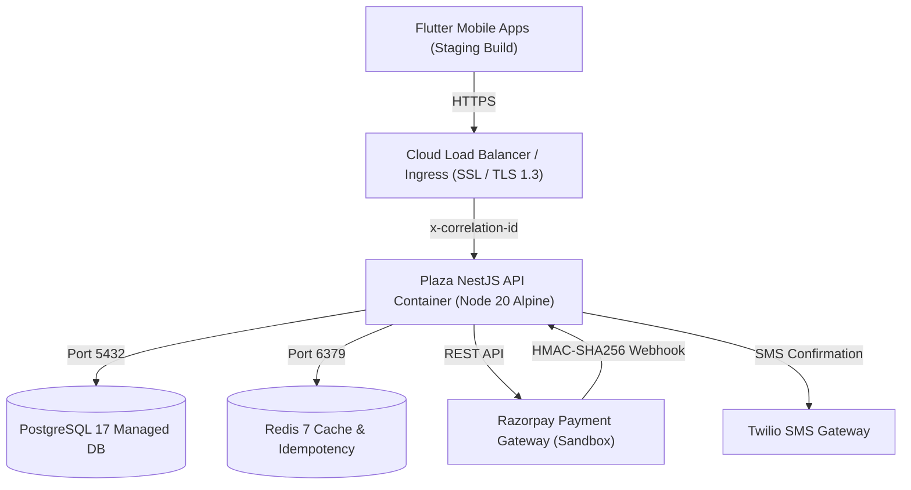

# PLAZA — Cloud Staging Deployment Guide

This guide details how to stand up, configure, and operate the PLAZA staging infrastructure using Docker, PostgreSQL 17, Redis, Razorpay Sandbox, and Twilio SMS.

---

## 1. Cloud Architecture Overview



---

## 2. Quickstart: Staging with Docker Compose

1. **Clone the repository on the staging host**:
   ```bash
   git clone git@github.com:plaza-club/plaza.git
   cd plaza
   ```

2. **Configure environment variables**:
   ```bash
   cp backend/.env.staging.example .env.staging
   # Populate RAZORPAY_KEY_ID, RAZORPAY_KEY_SECRET, and RAZORPAY_WEBHOOK_SECRET
   ```

3. **Start the staging stack**:
   ```bash
   docker compose -f docker-compose.staging.yml --env-file .env.staging up -d --build
   ```

4. **Verify container health**:
   ```bash
   docker compose -f docker-compose.staging.yml ps
   ```

5. **Run database migrations inside the container**:
   ```bash
   docker compose -f docker-compose.staging.yml exec plaza-api npm run migration:run
   ```

6. **Seed realistic staging catalog fixture**:
   ```bash
   docker compose -f docker-compose.staging.yml exec plaza-api npm run seed
   ```

---

## 3. Configuring Razorpay Webhooks (Sandbox / Production)

1. Log in to the [Razorpay Dashboard](https://dashboard.razorpay.com).
2. Navigate to **Settings** ➔ **Webhooks** ➔ **Add New Webhook**.
3. Set **Webhook URL**:
   ```
   https://api-staging.plaza.club/api/v1/webhooks/razorpay
   ```
4. Set **Secret**: Copy from `RAZORPAY_WEBHOOK_SECRET` in `.env.staging`.
5. Select active events:
   - `order.paid`
   - `payment.captured`
   - `payment.failed`
   - `refund.processed`
6. Click **Save Webhook**.

---

## 4. Testing Webhook Security with curl

Simulate an authenticated webhook event signed with HMAC-SHA256:

```bash
WEBHOOK_SECRET="whsec_test_plaza2026"
PAYLOAD='{"event":"order.paid","id":"evt_test_123","payload":{"order":{"entity":{"id":"order_test","receipt":"PLZ-MOV-99999"}},"payment":{"entity":{"id":"pay_test","amount":101500}}}}'

SIGNATURE=$(echo -n "$PAYLOAD" | openssl dgst -sha256 -hmac "$WEBHOOK_SECRET" | sed 's/^.* //')

curl -X POST http://127.0.0.1:3000/api/v1/webhooks/razorpay \
  -H "Content-Type: application/json" \
  -H "x-razorpay-signature: $SIGNATURE" \
  -d "$PAYLOAD"
```

Expected Response:
```json
{"success":true,"eventId":"evt_test_123","event":"order.paid"}
```

Replaying the same command immediately verifies idempotency:
```json
{"status":"ignored","reason":"already_processed","eventId":"evt_test_123"}
```

---

## 5. Connecting the Flutter Client to Staging

The Flutter client supports dynamic staging URL injection at compilation or launch time:

```bash
# Run on connected device or simulator targeting staging
flutter run --dart-define=PLAZA_API_URL=https://staging-api.plaza.app/api/v1

# Build release staging APK
flutter build apk --release --dart-define=PLAZA_API_URL=https://staging-api.plaza.app/api/v1

# Build iOS release bundle targeting staging
flutter build ipa --release --dart-define=PLAZA_API_URL=https://staging-api.plaza.app/api/v1
```

---

## 6. Verifying Client Request Idempotency

Test client booking deduplication by sending two identical requests with the same `Idempotency-Key` header:

```bash
TOKEN="<JWT_TOKEN>"
KEY="idemp_$(date +%s)"
PAYLOAD='{"movieId":"mov_1","theatreId":"theatre_amb","showtimeId":"amb_st_1","seatIds":["K1","K2"],"movieTitle":"Dune 2","theatreName":"AMB Cinemas","posterUrl":"","date":"2026-10-10","time":"10:15 AM"}'

# Request 1 (Initial creation)
curl -X POST http://127.0.0.1:3000/api/v1/bookings/movie \
  -H "Authorization: Bearer $TOKEN" \
  -H "Content-Type: application/json" \
  -H "Idempotency-Key: $KEY" \
  -d "$PAYLOAD"

# Request 2 (Client network retry - returns cached booking)
curl -X POST http://127.0.0.1:3000/api/v1/bookings/movie \
  -H "Authorization: Bearer $TOKEN" \
  -H "Content-Type: application/json" \
  -H "Idempotency-Key: $KEY" \
  -d "$PAYLOAD"
```
Both calls return identical JSON responses, with only 1 row inserted into `bookings` and 1 row in `idempotency_records`.

